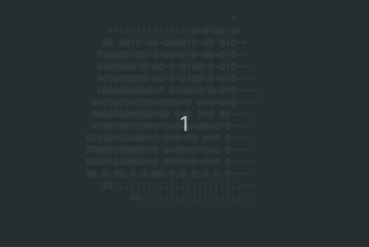

# 
Spinning Cube in C++

This code written in C++ is based on [Servet Gulnaroglu](https://github.com/servetgulnaroglu)'s repository of [cube.c](https://github.com/servetgulnaroglu/cube.c) developed in C.

## Fundamentals

The mathematical foundation behind this process is the concept of [rotation matrix](https://en.wikipedia.org/wiki/Rotation_matrix) in Euclidean space.

The following rotation matrices perform rotations of vectors around the x, y, or z axis in three-dimensional space:

$$
Rx(θ) = \left(\begin{array}{cc}
1 & 0 & 0\\
0 & cos(θ) & -sin(θ)\\
0 & sin(θ) & cos(θ)
\end{array}\right)
$$

$$
Ry(θ) = \left(\begin{array}{cc}
cos(θ) & 0 & sin(θ)\\
0 & 1 & 0\\
-sin(θ) & 0 & cos(θ)
\end{array}\right)
$$

$$
Rz(θ) = \left(\begin{array}{cc}
cos(θ) & -sin(θ) & 0\\
sin(θ) & cos(θ) & 0\\
0 & 0 & 1
\end{array}\right)
$$

Taking into account an operator

$$
\left(\begin{array}{cc}
i & j & k
\end{array}\right)
$$

it is possible to calculate the vectors for each axis using matrix multiplication.

### Buffer

A buffer is simply an area of memory that stores temporary data. In this context, it is used to store the visual representation of the scene to be displayed on the screen.

Here, `buffer` is an array representing the screen. Each element of this array contains a character that will be printed on the screen. During the rendering process, this buffer is filled with the characters representing the 3D scene before being printed on the screen.

### Z-buffer (depth buffer)

The z-buffer is used to handle the hiding of surfaces. In 3D environments, several objects may be in the same position on the screen, but at different depths. The z-buffer stores the distance (or depth) of each pixel in 3D space.

In this repository, `z_buffer` is an array that stores the depth values for each position in the buffer. Before drawing a point on the screen, the value of ooz (inverse of z) is checked and compared to the existing value in the z-buffer to determine if the point is visible based on its distance from the camera.

### OOZ (One over Z)

This variable represents the inverse of the Z coordinate (1/z). It is used to calculate the position on the screen of a point in three-dimensional space based on perspective. By multiplying the `x` and `y` coordinates by `ooz`, the position of the point is adjusted according to its distance from the camera. Its main purpose is to adjust the coordinates projected on the screen based on perspective.

## TODO:

1. Replacing memset() with std::fill();

#### `void *memset ( void *s, int c, size_t n);`

The memset function copies the value of c (converted to an unsigned char) to each of the first n characters in the object to which s points. The memset function returns the value of s.

`memset(buffer, background_ASCII_code, WIDTH * HEIGHT);`

Links: https://www.geeksforgeeks.org/memset-in-cpp/
