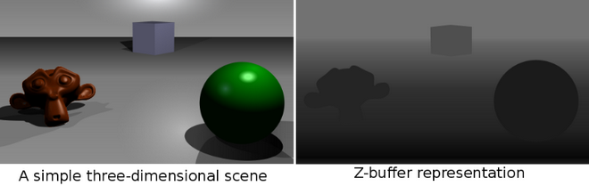

# Spinning Cube

Esto representa el proceso continuo de cálculo de la matriz de rotación 3D de un cubo.

Con base en la operación de álgebra matricial:

Dando como resultado la operación:

## Z-Buffer

En computación gráfica, el z-buffering es la parte de la memoria de un adaptador de video encargada de gestionar las coordenadas de profundidad de las imágenes en los gráficos en tres dimensiones (3-D), normalmente calculados por hardware y algunas veces por software.

El Z-buffering también se conoce como buffering de profundidad, debido a que la profundidad del píxel generado (coordenada z) al ser dibujado por una tarjeta gráfica 3D, se almacena en un búfer de datos (el z-buffer).

---

## memset() - C Library Function

#### `void *memset ( void *s, int c, size_t n);`

La función memset copia el valor de c (convertido a un unsigned char) a cada uno de los primeros n caracteres en el objeto al cual señala s. La función memset devuelve el valor de s.

`memset(buffer, background_ASCII_code, WIDTH * HEIGHT);`

Links: https://www.geeksforgeeks.org/memset-in-cpp/

---

## TODO:

1. Replacing memset() with std::fill();
